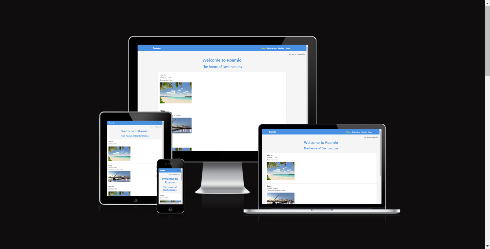

# Roamio

## Introduction

Roamio is a travel destination website, and the name "Roamio" symbolizes the joy of exploring new places and the spirit of adventure. Roamio has been developed as part of the Code Institute's Full-Stack Developer course as my final project—focusing on Django and Bootstrap frameworks, database manipulation, and CRUD functionality.

View the live site here: [Roamio](https://roamio-b0271c7950f0.herokuapp.com/)

For Admin access with relevant sign-in information: [Roamio Admin](https://roamio-b0271c7950f0.herokuapp.com/admin/)

- Username : john9810

- Password : malahide

## Table of Contents

- [Roamio](#roamio)
  - [Introduction](#introduction)
  - [Table of Contents](#table-of-contents)
  - [Overview](#overview)
- [UX - User Experience](#ux---user-experience)
  - [Wireframes](#wireframes)
  - [Site Structure](#site-structure)
  - [Design Inspiration](#design-inspiration)
    - [Colour Scheme](#colour-scheme)
- [Project Planning](#project-planning)
  - [Strategy Plane](#strategy-plane)
    - [Site Goals](#site-goals)
  - [Agile Methodologies - Project Management](#agile-methodologies---project-management)
  - [User Stories](#user-stories) 
  - [Database Schema](#database-schema)
  - [Scope Plane](#scope-plane)
- [Features](#features)
  - [Existing Features](#existing-features)
  - [Future Features](#future-features)
- [Technologies Used](#technologies--languages-used)
  - [Languages](#languages)
  - [Frameworks](#frameworks)
  - [Software](#software)
  - [Libraries](#libraries)
- [Testing](#testing)
  - [User Story](#user-story-tests)
  - [Validator Tests](#validator-tests)
  - [Input Validation](#input-validation-tests)
  - [Automated Test](#automated-testing)
  - [Responsive Tests](#responsive-tests)
  - [Lighthouse Test](#lighthouse-tests)
  - [Wave Accessibility Test](#wave-accessibility-tests)
- [Deployment](#deployment)
  - [Connecting to GitHub](#connecting-to-github)
  - [Django Project Setup](#django-project-setup)
  - [Cloudinary API](#cloudinary-api)
  - [Heroku Deployment](#heroku-deployment)
  - [Clone Project](#clone-project)
  - [Fork Project](#fork-project)
- [Credits](#credits)
  - [Code](#code)
  - [Media](#media)
    - [Website Content](#website-content)
  - [Acknowledgements](#acknowledgements)

## Overview

Roamio is a travel destination website that inspires users to explore new places around the world. Users are invited to:

- Join the Roamio community
- Create their own user
- Explore and interact with featured travel destinations
- Share their own travel experiences
- Share destinations over social media

Roamio is accessible via all browsers with full responsiveness on different screen sizes. The objective of the project is to develop a comprehensive travel website where users can discover, save, and share travel destinations. The website aims to provide a user-friendly platform for individuals interested in travel to find a wide range of destinations and experiences. Additionally, the website will facilitate interaction and engagement among users through features such as commenting, rating, and sharing destinations.

# UX - User Experience

## Wireframes

Wireframes were created using [Balsamiq](https://balsamiq.com/) to plan content flow and styling for Roamio. Some differences can be seen between the original wireframes and the finished product.

### Home Page 

### Destination Details

### Search Destinations

### Add Destination

## Site Structure 

The website is organized into several main sections to provide users with a seamless browsing experience. Upon landing on the homepage, users are greeted with a selection of featured destinations, showcasing the most popular travel spots.

For new users or those who need to log in, the website provides authentication pages for logging in and signing up.

Finally, the footer of the website contains essential info about the website and links to the website's social media profiles, allowing users to stay connected and informed about the latest updates and news related to Roamio.

## Design Inspiration

The design inspiration behind the Roamio website is rooted in creating a visually appealing and inviting user experience. With a focus on travel and adventure.
The choice of a background contributes to a clean and minimalist aesthetic, providing a canvas for the vibrant color scheme that reflects the diversity of destinations featured on the website.

The logo name Roamio, serves as a visual representation of the website's name and theme. By incorporating elements related to travel, the logo reinforces the concept of discovery and adventure.

### Colour Scheme

The color scheme for Roamio has been carefully selected to create a modern and visually appealing experience, reflecting the themes of exploration and travel.

**Primary Color (Blue): `#4A90E2`**  
This custom blue color is used throughout the site, primarily in the navigation bar, buttons, and headings. It represents the open sky and ocean, symbolizing the freedom and adventure associated with travel.

**Secondary Color (Gray): `#555`**  
A subtle gray color is applied to text in various sections of the website, providing a clean and neutral contrast to the primary blue and white backgrounds.

**Background Color (Light Gray): `#f5f5f5`**  
Used as the background for the main content area and certain sections, this light gray color gives the website a clean and modern feel, ensuring readability and focus on the content.

**White Backgrounds: `#ffffff`**  
White is utilized for the list items, forms, and other content blocks, maintaining a minimalist and uncluttered look. It provides a strong contrast against the blue accents, making the site feel open and airy.

**Hover Effects:**

- **Button Hover (Darker Blue): `#357ABD`**  
  On hover, buttons darken to a richer blue, providing a clear visual feedback for users and enhancing the interactive experience.

- **Social Icons Hover (Yellow): `#F8E71C`**  
  Social icons enlarge slightly and change to yellow on hover, drawing attention and inviting users to interact.

This combination of colors ensures that Roamio is not only visually attractive but also aligns with the thematic elements of travel, making the user experience both engaging and intuitive.

# Project Planning  
 
## Strategy Plane

The focus of the website is on creating a user-centric platform that inspires users to explore the world and discover new travel destinations. Our key objectives include:

1- User Engagement: Prioritizing features that enhance user interaction and encourage community participation, such as destination sharing, commenting, and rating.

2- Exploration: Curating a diverse collection of travel destinations from around the world, ensuring a wide range of options for different types of travelers.

3- Visual Identity: Establishing a distinctive visual identity through carefully selected colors, fonts, and imagery that reflect the excitement and beauty of travel.

4- Accessibility: Designing a user-friendly interface that is accessible to all users, regardless of their device or abilities, to ensure an inclusive experience for everyone.

5- Scalability: Building a robust and scalable platform capable of accommodating future growth and expansion, including the addition of new features and functionalities.

### Site Goals

1- Discover Destinations: Users want to find new and interesting travel destinations to explore.

2- Interact with Community: Users want to engage with other users by sharing their experiences, leaving comments.

4- Contribute Content: Users want to contribute their own travel experiences to the website and share them with others.

#### Project Status and Request for Extension
Unfortunately, I was unable to complete the project and the README by the original deadline. Despite working diligently and putting in long hours, I encountered some challenges and struggled with the learning process, which has affected my progress and sleep.

I apologize for any inconvenience this may cause. I am requesting an extension to finalize the project and ensure it meets the highest standards. Thank you for your understanding and patience.

If not maybe it is possible that this project can still achieve a grade.